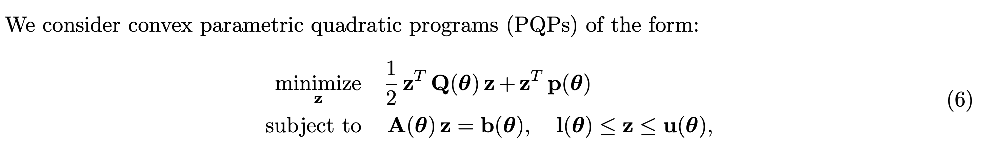

# lqp_py
lqp_py (learning quadratic programs) is a Python package for efficiently solving medium to large scale batch box-constrained quadratic programs. The QP solver is implemented as a custom PyTorch module. The forward solver invokes a basic implementation of the ADMM algorithm. Backward differentiation is performed by implicit differentiation of a fixed-point mapping customized to the ADMM algorithm.

For more information please see our publication:

[Computational Optimization and Applications](https://link.springer.com/article/10.1007/s10589-022-00422-7)

[arXiv (preprint)](https://arxiv.org/pdf/2112.07464.pdf)

## Core Dependencies:
To use the ADMM solver you will need to install [numpy](https://numpy.org) and [Pytorch](https://pytorch.org). If you want to invoke the SCS solver then you will need to install [scs](https://www.cvxgrp.org/scs/) and [SciPy](https://scipy.org).

Please see requirements.txt for full build details.

## Runtime Experiments:
The [demo](demo) directory contains simple demos for forward solving and backward differentiating through the ADMM solver. The following runtime experiments are available in the [experiments](experiments) directory.

All experiments are conducted on an Apple Mac Pro computer (2.6 GHz 6-Core Intel Core i7,32 GB 2667 MHz DDR4) running macOS ‘Monterey’.

### Experiment 1:
Runtime: dz = 10            |  Convergence: dz = 50    
:-------------------------:|:-------------------------:
  |  

Runtime: dz = 100            |  Convergence: dz = 250    
:-------------------------:|:-------------------------:
  |  

Runtime: dz = 500            |  Convergence: dz = 1000    
:-------------------------:|:-------------------------:
  |  

Computational performance of ADMM FP, ADMM KKT, ADMM Unroll, Optnet and SCS for various problem sizes (dz). Batch size = 128 and stopping tolerance = 10^-5.

### Experiment 2:

Runtime: dz = 500            |  Convergence: dz = 500    
:-------------------------:|:-------------------------:
  |  

Training loss and computational performance for learning p. Problem setup: dz = 500, batch size = 32, epochs = 30, and stopping tolerance = 10^-5.

## Notes: Limitations and Future Improvements

1. Most importantly, the lqp ADMM solver is capabale of only solving Quadratic Programs (QP) with linear equality constraints and box constraints. If your QP contains more general constraints then we recommend  [qpth](https://locuslab.github.io/qpth/) or [cvxpylayers](https://locuslab.github.io/2019-10-28-cvxpylayers/).

2. Computational performance may differ from exactly what is reported in the paper. In our experience, computational speed seems to be dependent on the hardware, language (Python or R) and package versions used for computations. Importantly, for large problems (number of decision variables > 500 and batch size > 64) the RAM consumption will cause a considerable slowdown. Making the forward and backward routines more memory efficient is a high priority.

3. When using ADMM solver, it is important that the QP variables are properly scaled and that the ADMM parameter (rho) is set appropriately. Automatic scaling and parameter selection is not currently implemented. We recommend that the user experiment with the scale of the QP input variables for their particular use-case.

4. Convergence of ADMM (and first-older solvers in general) can slow down if the matrix Q is rank deficient. We are currently exploring acceleration methods to improve  convergence for rank deficient Q cases.

5. For larger scale batch QPs (number of decision variables > 500 and batch size > 64), solving the linear system in the backward pass can be slow. We are currently exploring approximation methods for efficiently solving the backward linear system.
